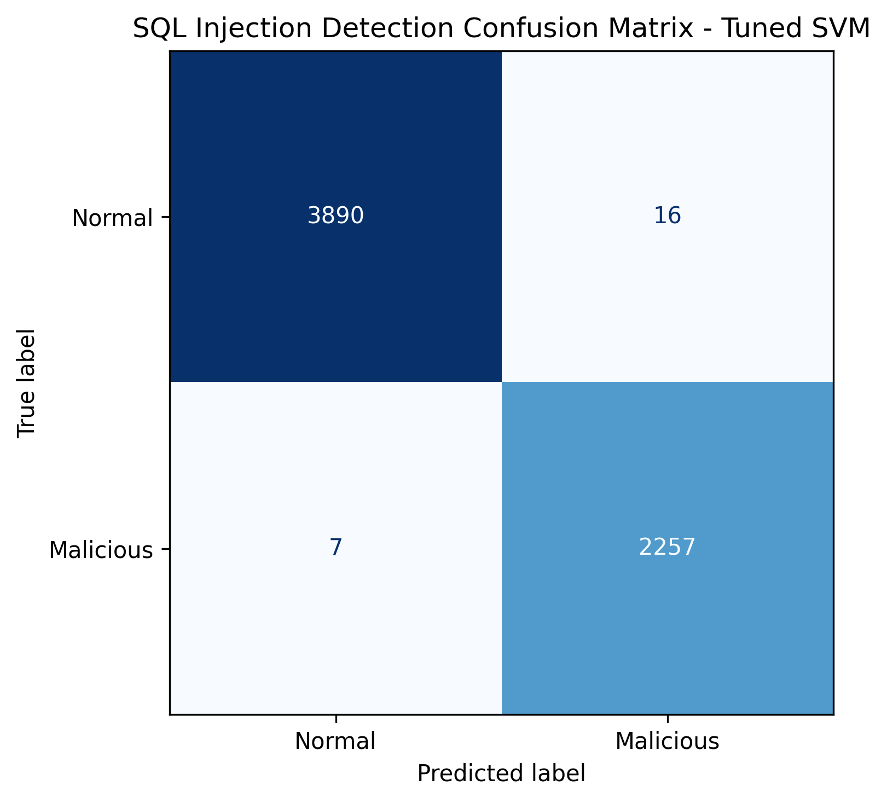

# SQL Injection Detection

Real-time ML-powered SQL injection detection API with decision-based blocking.

## Overview

This project provides a real-time machine learning API that classifies SQL queries as **Normal** or **Malicious** and returns an **allow/block** decision. It is designed as a backend security layer that can evaluate incoming SQL-like input before it reaches sensitive application logic or downstream systems.

The system combines a trained scikit-learn model, a FastAPI inference service, Docker deployment, and a public Render deployment. A React frontend is included for demonstration and testing, but the production focus is the backend API.

## Quick Start

Try the live API:

- Swagger UI: [https://sql-injection-detector-zn3b.onrender.com/docs](https://sql-injection-detector-zn3b.onrender.com/docs)
- Health Check: [https://sql-injection-detector-zn3b.onrender.com/health](https://sql-injection-detector-zn3b.onrender.com/health)

Example `curl` request:

```bash
curl -X POST https://sql-injection-detector-zn3b.onrender.com/predict \
  -H "Content-Type: application/json" \
  -d "{\"query\": \"' OR '1'='1\"}"
```

Example Python integration:

```python
import requests

API_URL = "https://sql-injection-detector-zn3b.onrender.com/predict"

response = requests.post(
    API_URL,
    json={"query": user_input}
)

result = response.json()

if not result["allowed"]:
    raise Exception("Blocked: Potential SQL injection detected")
```

The API is designed to be used by backend systems. The React UI in this repository is only a demo/testing interface. In production, another backend service would call `/predict` before processing risky user input.

## System Architecture

`Client / Backend -> FastAPI API -> ML Model -> Decision (allow/block)`

The FastAPI service loads the trained model, computes a decision score for each request, and applies a fixed threshold to determine whether the query should be treated as malicious. The React UI is only a demo/testing interface for easier local and public testing.

## Live API

| Endpoint | Link |
|---|---|
| Swagger UI | [https://sql-injection-detector-zn3b.onrender.com/docs](https://sql-injection-detector-zn3b.onrender.com/docs) |
| Health Check | [https://sql-injection-detector-zn3b.onrender.com/health](https://sql-injection-detector-zn3b.onrender.com/health) |

## API Usage

### `POST /predict`

Request:

```json
{
  "query": "' OR '1'='1"
}
```

Response:

```json
{
  "query": "' OR '1'='1",
  "score": 2.13,
  "prediction": "Malicious",
  "label": 1,
  "allowed": false
}
```

## Backend Integration Example

```python
import requests

API_URL = "https://sql-injection-detector-zn3b.onrender.com/predict"
query = "' OR '1'='1"

response = requests.post(API_URL, json={"query": query}, timeout=10)
response.raise_for_status()
result = response.json()

if not result["allowed"]:
    print("Blocked request:", result)
else:
    print("Allowed request:", result)
```

## Demo Interface

The project includes a React frontend as an optional demo UI. It allows users to enter a query, view the prediction, inspect the decision score, and see the final allow/block result in a simple interface.

In production, the API is intended to run as a backend security layer, not as an end-user UI.

## Features

- Real-time API-based inference
- Normal/Malicious classification
- Decision score
- Allow/block output
- Dockerized deployment
- Health check endpoint

## Machine Learning Pipeline

| Component | Configuration |
|---|---|
| Feature Extraction | Character-level TF-IDF n-grams 2–6 |
| Model | LinearSVC |
| Class Handling | `class_weight={0:1, 1:2}` |
| Threshold | `-0.40` |
| Validation | 5-fold stratified cross-validation |

## Threshold Optimization

`score >= -0.40 -> Malicious`  
`score < -0.40 -> Normal`

This threshold is used to reduce false negatives while keeping false positives at a reasonable level for a security-sensitive deployment.

## Evaluation Metrics

| Metric | Value |
|---|---|
| Accuracy | 99.63% |
| Malicious Recall | 99.69% |
| Malicious Precision | 99.30% |
| False Negatives | 7 |
| False Positives | 16 |

## Confusion Matrix



## Local Usage

Train the model:

```bash
python sql_injection_pipeline.py --data Modified_SQL_Dataset.csv
```

Build and run with Docker:

```bash
docker build -t sql-injection-api .
docker run -p 8000:8000 sql-injection-api
```

## Tech Stack

| Category | Technology |
|---|---|
| Language | Python |
| ML Library | scikit-learn |
| API Framework | FastAPI |
| Containerization | Docker |
| Deployment | Render |
| Frontend Demo | React |
| Data Processing | pandas |
| Visualization | matplotlib |
| Model Persistence | joblib |

## Design Decisions

| Decision | Reason |
|---|---|
| Security-first optimization | Reduce false negatives |
| Threshold tuning | Control detection sensitivity |
| Character-level TF-IDF | Capture SQL attack patterns |
| Linear SVM | Efficient and effective for sparse text features |
| Backend-first production design | API acts as a security service, UI is only demo |

## Important Security Note

This project is an additional detection layer and does not replace parameterized queries, ORM protections, or input validation.

## Future Work

- API authentication and rate limiting
- Model versioning
- Backend middleware integration
- Expanded real-world attack dataset
